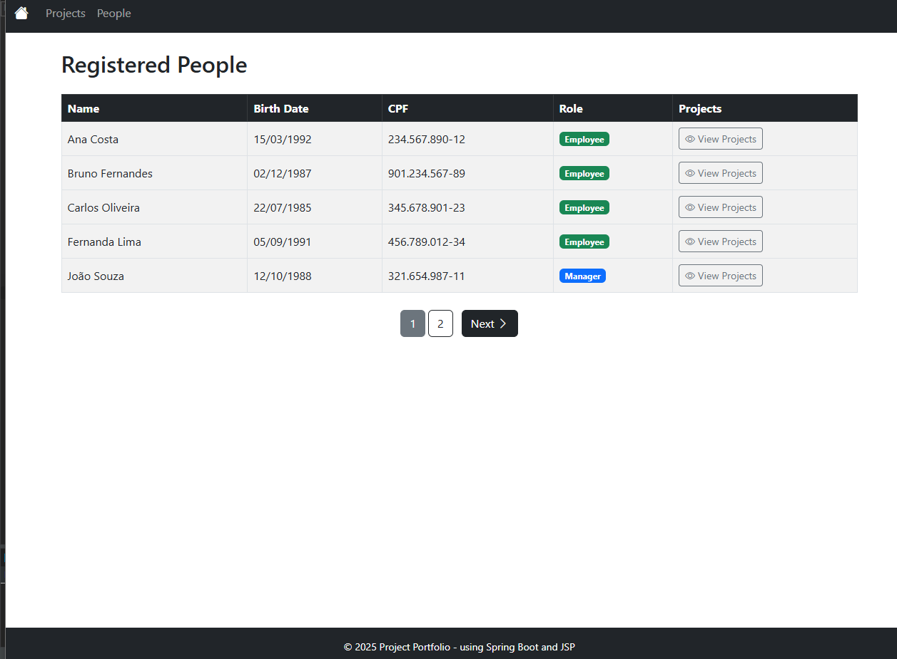
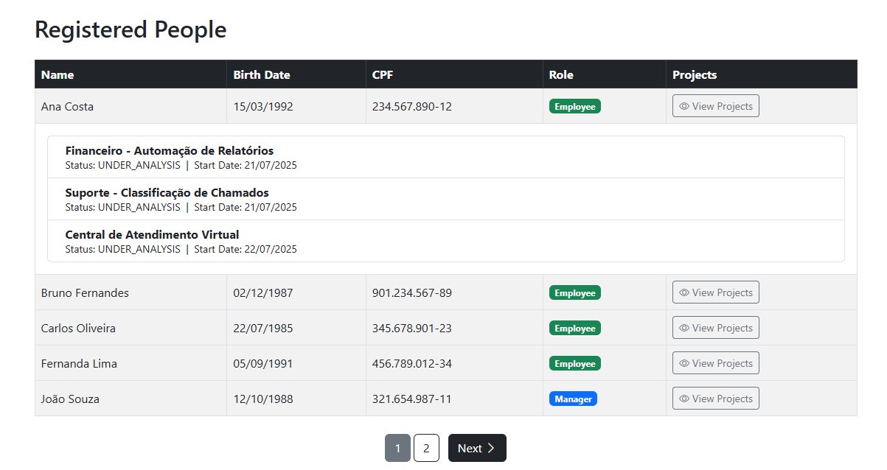
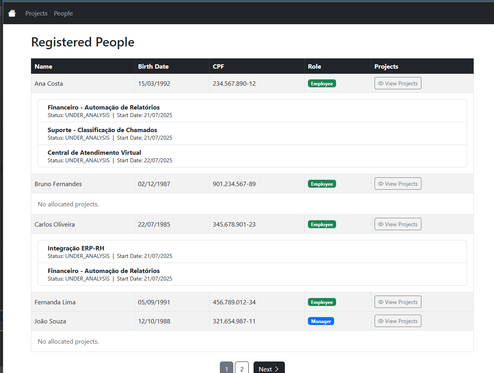
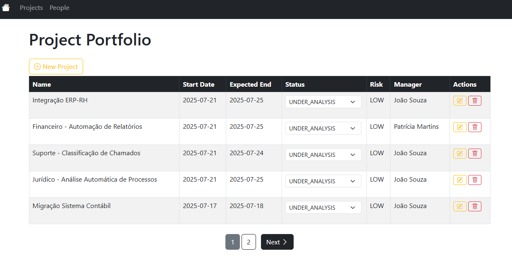
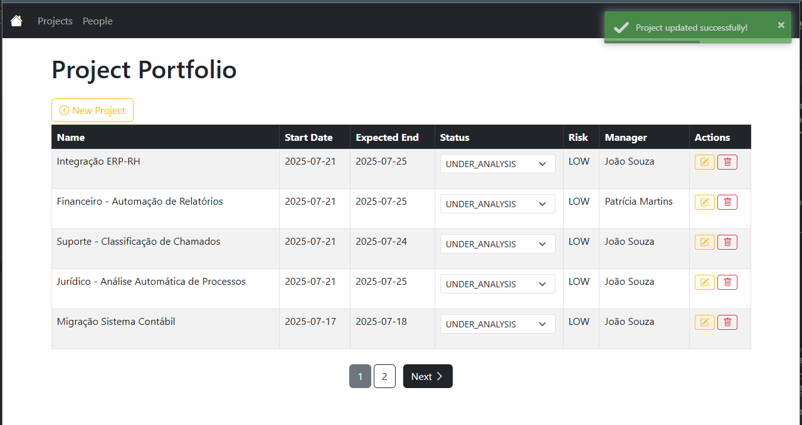
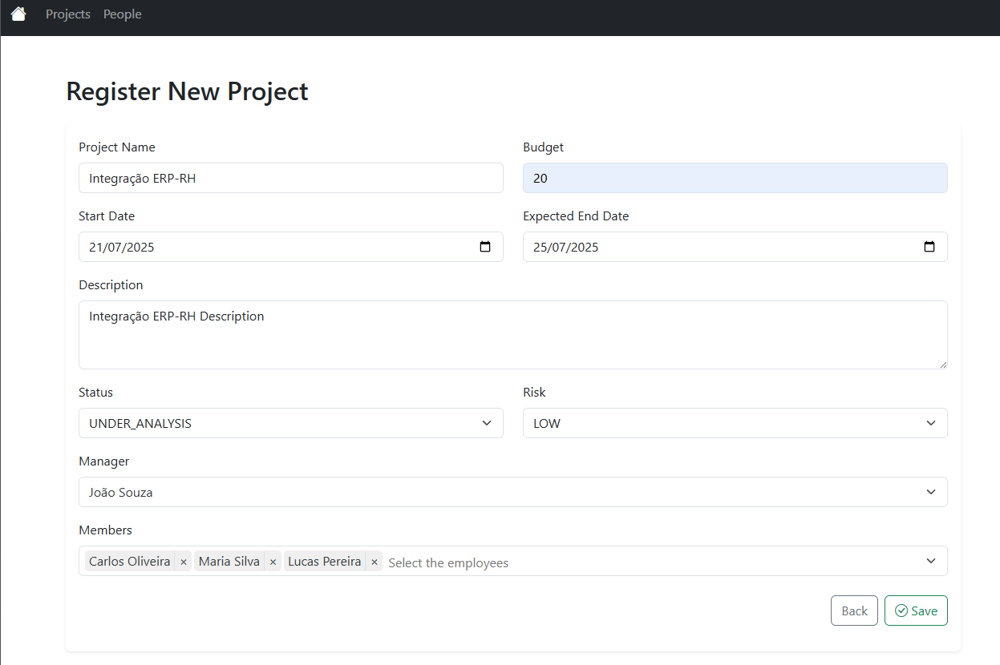
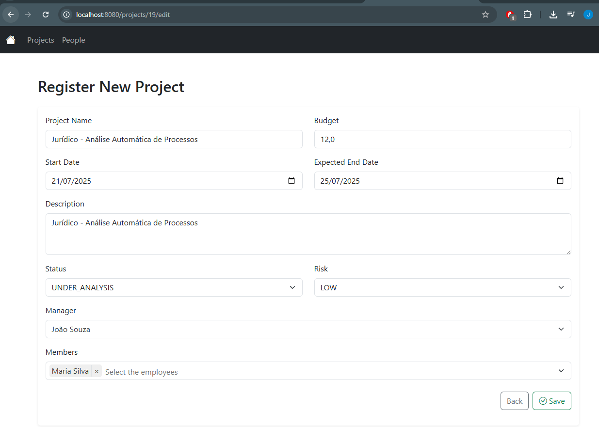
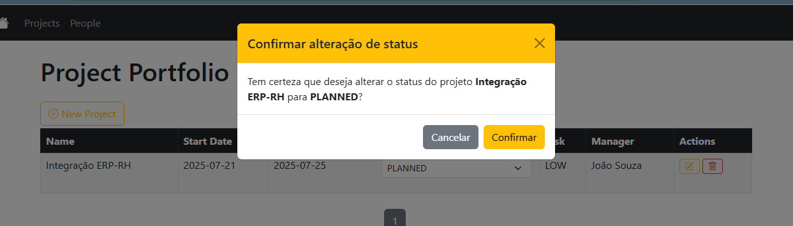
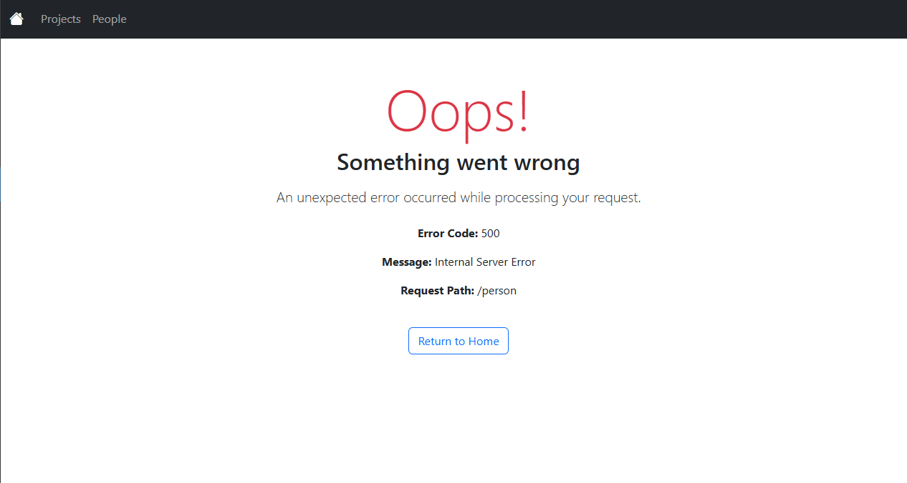
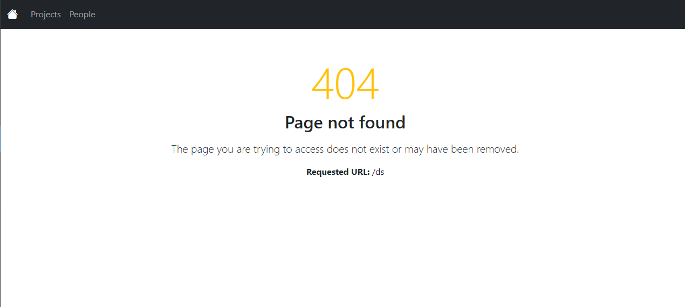

# 📊 Sistema de Portfólio de Projetos

Sistema com o objetivo de gerenciar os dados do portfólio de projetos de uma empresa, permitindo o cadastro, edição, visualização e exclusão de projetos, além da associação de membros (pessoas) com autenticação via API-Key, mensagens internacionalizadas, paginação, e tratamento de erros amigável tanto no frontend quanto na API REST.

---

## 🧰 Tecnologias Utilizadas

- Java 17
- Spring Boot 3.5.3 (Web, JPA, Security)
- Spring MVC (com JSP)
- Spring Data JPA
- Spring Security com autenticação via API-Key
- PostgreSQL (via Docker Compose)
- Hibernate Validator
- Maven
- Docker / Docker Compose
- Bootstrap 5
- Spring MessageSource (i18n)
- Tomcat (WAR)

---

## 🚀 Como Executar com Docker

### 1. Clone o projeto

```bash
git clone https://github.com/SEU-USUARIO/portfolio.git
cd portfolio/docker
```

### 2. Suba os containers

```bash
docker-compose up --build
```

A aplicação estará disponível em:

- Frontend: http://localhost:8080/projects
- API REST: http://localhost:8080/api/members

### 🔐 Autenticação da API

As rotas da API exigem um cabeçalho:

```
x-api-key: chave-parceiro-a
```

Você pode alterar as chaves válidas em `application.yml`.

---

## 🧭 Funcionalidades Principais

### 👤 Gestão de Pessoas (Membros)

- Cadastro de membros via API REST (POST /api/members)
- Listagem de membros via página `/person` (somente leitura)
- Cada membro possui: nome, data de nascimento, CPF e cargo (MANAGER ou EMPLOYEE)
- Apenas membros com cargo EMPLOYEE podem ser associados a projetos

🖼️ *Espaço para print da tela `/person` com paginação*



---

### 📁 Gestão de Projetos

- Cadastro, edição, exclusão e alteração de status de projetos
- Associação de membros ao projeto
- Cada projeto contém: nome, datas, orçamento, gerente, descrição, status e risco
- Página `/projects` com paginação e filtros
- Validações com mensagens amigáveis

#### Regras de Negócio:

- Projetos com status “iniciado”, “em andamento” ou “encerrado” **não podem ser excluídos**
- Status e Risco são enums fixos (não cadastráveis)
- Apenas membros `EMPLOYEE` podem ser adicionados aos projetos

🖼️ *Espaço para prints:*
- Listagem de projetos (`/projects`)
- 
- 
- Formulário de criação (`/projects/new`)
- 
- Tela de edição (`/projects/{id}/edit`)
- 
- Tela de alteração de status
- - 

---

### 🌐 API RESTful

| Método  | Endpoint            | Descrição                     |
|---------|---------------------|-------------------------------|
| `POST`  | `/api/members`      | Cadastrar novo membro         |
| `GET`   | `/api/members`      | Listar membros paginados      |
| `GET`   | `/api/members/{id}` | Listar um membro por ID       |
| `PUT`   | `/api/members/{id}` | Atualizar um membro existente |
| `DELETE`| `/api/members/{id}` | Remover um membro por ID      |

- Autenticação via API-Key
- DTOs com validação automática
- Mensagens de erro e sucesso internacionalizadas

---

### 📦 Importação via Postman (Documentação da API)

Como a aplicação utiliza JSP (e não permite uso do Swagger UI), incluímos uma collection Postman com todos os endpoints REST documentados e prontos para teste.

#### 📥 Como importar

1. Abra o Postman e clique em **Import > Upload Files**
2. Selecione o arquivo `PortfolioAPI.postman_collection.json` disponível na pasta [`postman/`](./postman/Portfolio API - Members.postman_collection.json)
3. Insira a seguinte chave nos headers das requisições:

```
x-api-key: 
```

### 🌍 Internacionalização

- Arquivo `messages.properties` usado para exibir labels, mensagens de erro e sucesso
- Utilização da tag `<spring:message code="..."/>` nas páginas JSP
---

### 🛠️ Tratamento de Erros

- Página global de erro `/error.jsp` para falhas inesperadas
- 
- Página 404 personalizada (`/WEB-INF/views/error/404.jsp`)
- 
- Todas mensagens são internacionalizadas

🖼️ *Print de erro global (ex: exceção ou erro 500)*  
🖼️ *Print de página 404 customizada*

---

## 🧪 Testes

- Cobertura de:
    - Criação e atualização de projetos
    - Regras de exclusão por status
    - Associação de membros
    - Validação de campos obrigatórios

---

## 🧱 Estrutura do Projeto

```
src
├── main
│   ├── java
│   │   └── br.com.portfolio
│   │       ├── controller            # Controllers JSP
│   │       ├── api.controller       # Controllers REST
│   │       ├── model                # Entidades JPA
│   │       ├── service              # Regras de negócio
│   │       ├── dto                  # DTOs da API
│   │       ├── util                 # Utilitários
│   │       └── config               # Segurança e configuração
│   └── resources
│       ├── messages.properties      # Internacionalização
│       └── templates (JSPs)
docker
├── docker-compose.yml
```


---

## ✅ Checklist Final

- [x] Backend em Spring Boot com WAR funcional
- [x] Frontend em JSP com Bootstrap 5
- [x] API REST com autenticação por API Key
- [x] Tratamento de erros com páginas JSP customizadas
- [x] Internacionalização com `messages.properties`
- [x] Validações com feedback amigável
- [x] Paginação funcional em projetos e membros
- [x] Docker Compose com PostgreSQL

---

